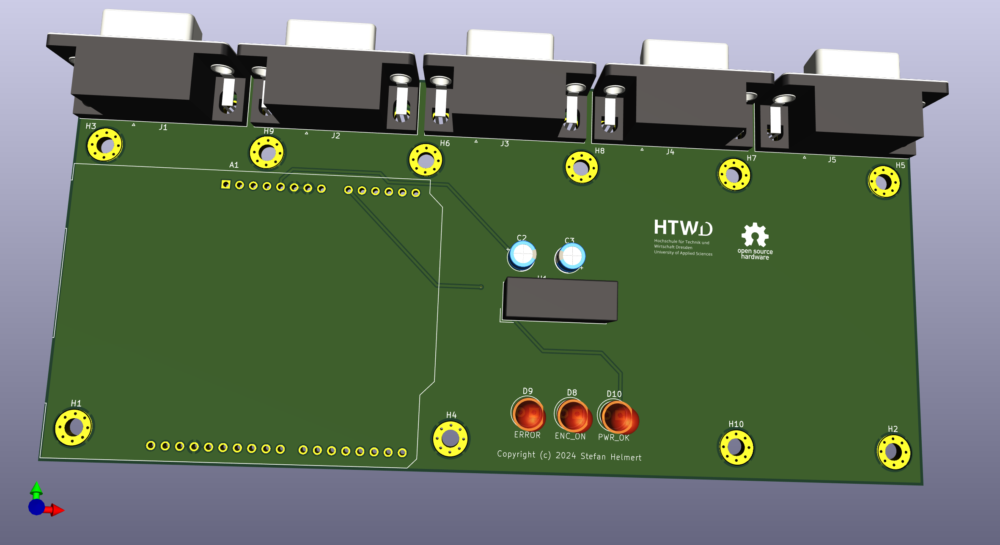
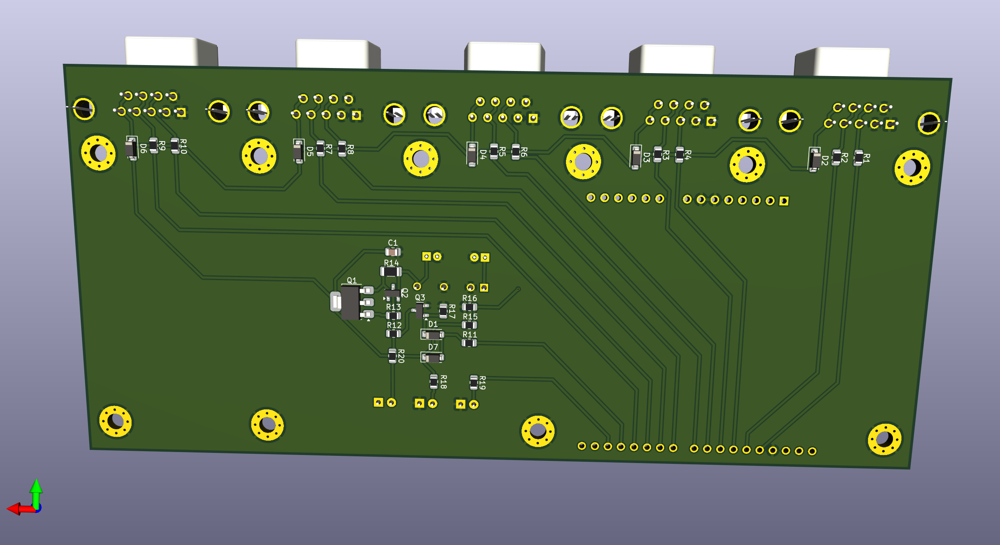
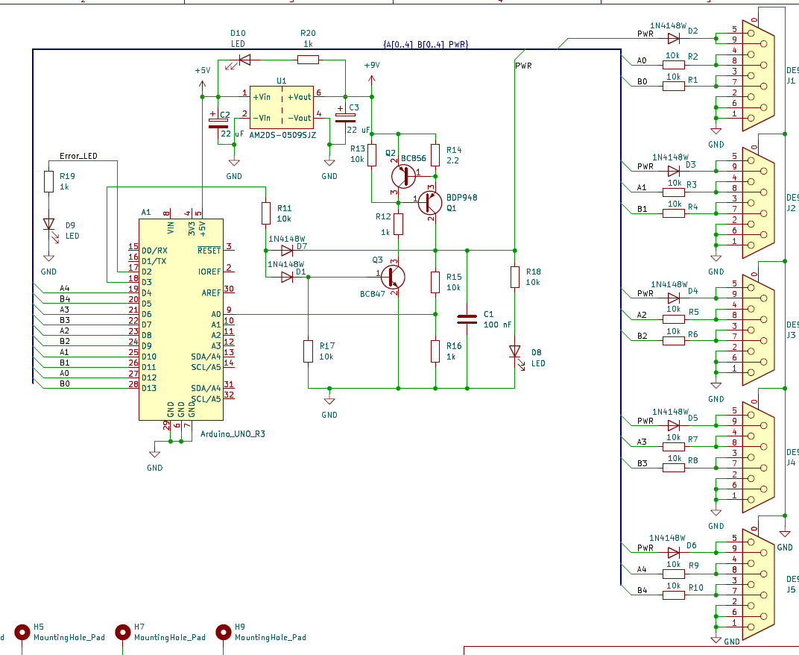

# Coordinate Measurement Arm Logic Board

This logic board implements the main functionality of the 5-dof coordinate measurement arm. The central component is an _Arduino UNO R3_. It reads the rotary encoders out and provides the communication to the host PC and power supply via the USB port. 

The 5 rotary encoders are plugged into the D-Sub-9 socket. The board implements electrical protection circuits, that the _Arduino_ won't be damaged, if voltage is accidentally applied to the encoder connectors. Unfortunatelly, the  USB port can't be protected, because it is directly part of the _Aduino_.

The board also boosts the power supply voltage from the USB port to operate the rotary encoders.

## Implementation

The rotary encoders are powered by a 5 V to 9 V voltage converter, because they need at least 5 V. This lower limit is not maintained by the USB port, which can deliver down to 4.75 V.

Diodes protect the board from excessive positive voltage from the encoder connectors, while 3 transistors protect it from short circuit and negative voltage levels on the encoder supply line. The shunt _R14_ sets the current limit to around 300 mA. At this cuurent level, the b-e-voltage of _Q2_ reaches 660 mV. IN this case _Q2_ starts to disable the output transistor _Q1_. If the output voltage drops down to around 0 V, the diode _D7_ switches the transistor _Q3_ off and so also _Q1_. This reduces the output current in case of short circuit or reverse polarity voltage injection into the power supply output. Diode _D1_ protects _Q3_ against reverse voltage on the output line. 

The _Arduino_ is able to measure the output voltage to report short circuit conditions also as a self test for production end test. 

The encoder data lines are connected via 10k resistors to the _Arduino_ to protect the inputs against excessive voltage from the encoder connector.

The open collector outputs of the encoders need pull-up resistors. These are integrated into the plug of the encoder itself.

If the board is powered up, the power on indicator LED _D10_ shows the correct operation of the voltage converter. If the power supply for the rotary encoders is on, LED _D8_ lights up. For debugging and error indication, the LED _D9_ can be activated by the _Arduino_.

## Associated Projects

The rotary encoders are shipped with open wire ends. A plug has to be attached to this cable. Because there is no electrical protection in the encoder itself. it should be integrated in the plug. This project implements the protection circuit:

* https://github.com/TheTesla/rotary-encoder-protection

## Author/Contact

Stefan Helmert <stefan.helmert@htw-dresden.de>

## Appendix

### Pictures

The following pictures show the rendering of the assembled pcb. The arduino board is not available as 3d model.

### Schematics

